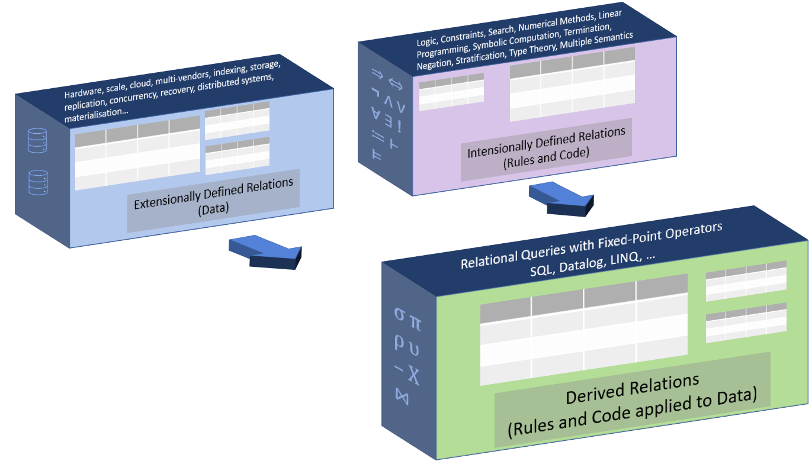

# Jetisu


Jetisu is a toolset for modelling with __intensionally defined relations__.
- a "__relation__" is a table with columns and rows,
- "__intensionally defined__" means the the table is defined by computable rules rather than by a list of rows.

## "Doing for computation and rules what the relational model did for data"
Prior to the advent of the relational model, programmers' mental model of data spanned multiple levels of abstraction and required them to procedurally navigate either hierarchies or networks to access data. The relational model challenged this approach and provided a long-lived and robust mental model of data for programmers to use (Schemas and SQL).  

One of the relational model's key benefits is that programmers were, to a greater extent, insulated from innovation in database technologies. This isolation reduced, or removed, the cost of adoption of innovations in technologies such as: hardware, caching, virtualisation, cryptography, storage, sharding, redundancy, indexing, query optimisation, distributed systems, etc.

The Jetisu Toolkit is exploring the possibility that the relational model can do for rules and code what it did for data. The following diagram is a representation of what this might look like:


Jetisu is understood to be the [first implementation of intensionally defined relations](docs/first_implementation.md). If you are aware of an earlier implementation, please raise an issue.

## Querying Rules As Code
The examples are chosen to illustrate the benefits (and/or challenges) of querying intensionally defined relations to model rules as code.
- [ACT Conveyance Duty](ACT_Conveyance_Duty.ipynb)
- [Australian GST](Australian_GST.ipynb)
- [Birthday Money](Birthday%20Money.ipynb)
- [Australian COVID vaccinations up-to-date and eligibility](COVID_vaccinations.ipynb)
- [Australian COVID vaccinations mandatory for work roles](COVID_vaccinations_and_work.ipynb)
- [Eligibility for rates subsidy](eligible_for_rates_subsidy.ipynb)
- [Range](Range.ipynb)

## Interactive Q&A with Rules as Code
This example shows interactive Q&A using the same rule-set as the above "Australian COVID vaccinations mandatory for work roles" example:
- [Am I required to have COVID vaccinations?](Goal_seeking_covid_vaccination_and_work.ipynb)

## Edit and re-run the example notebooks
You can  ```docker run``` the example Jupyter notebooks for yourself.

```shell
docker run -p 8888:8888 ghcr.io/davidpratten/jetisu:latest
```
Here is help on [How to run the example notebooks](docs/run_notebooks.md) 
## Background to "intensionally defined relations"
Every table has an intension, which is its intended meaning and its extension which is its list of rows. But not all tables 
are defined in the same way!  

| How defined           | Intension (a test that is true if a row is a member of the table) | Extension (list of rows)          |
|-----------------------|-------------------------------------------------------------------|-----------------------------------|
| Extensionally defined | Natural Language                                                  | __Listed out in a table__         |
| Intensionally defined | __Computable Constraints and Rules__                              | Generated or recognised on demand |

Here is ChatGPT's response to the question "_please tell me  the difference between extensionally defined relations and intensionally defined relations_"
> An extensional relation is defined based on the actual elements that are related, while an intensional relation is defined based on the properties 
> or characteristics of the elements that are related. For example, "is the capital of" is an extensional relation because it is defined based on 
> specific cities (e.g. "Paris is the capital of France"). On the other hand, "is taller than" is an intensional relation because it 
> is defined based on the property of height (e.g. "John is taller than Jane").

The idea of a relation that is defined by computable constraints and rules goes back to the 1970's and 1980's at the beginning of the relational database era. Early references include:

- __Algorithmic relations__ proposed in 1975 by Patrick Hall, Peter Hitchcock and Stephen Todd. [(PDF)](https://dl.acm.org/doi/pdf/10.1145/512976.512998) 
- __Computed relations__ described in 1981 by David Maier and David Warren. [(PDF)](https://dl.acm.org/doi/pdf/10.1145/582318.582345)

These proposals share a common assumption that computation is inherently directed. Neither paper suggested that an algorithmic, or computed relation could be defined in such a way that all directions of computation might be possible "out-of-the-box" with just a single definition.

The maturation of satisfaction solvers and of the constraint language [MiniZinc](https://www.minizinc.org) have provided the building blocks for realising ideas that were put forward nearly 50 years ago. The Jetisu toolkit calls these algorithmic, or computed, relations: "intensionally defined relations".

## Theory of intensionally defined relations
An __intensionally defined relation__ is 
- a set of typed attributes (or columns) A, along with
- a set of declarative and computable satisfaction constraints C over the attributes in A, which
- when further constrained in a relational query, is indistinguishable, (within some error bound 𝜖), from its finite extension of tuples (rows).

This definition closely mirrors the definition of a relation in relational database theory, and here are some implications of this definition:

__Intimate connection between the constraints in the definition and the ```WHERE``` clause in the query:__ A key implication of the above definition is that the relational algebra ```SELECT``` or ```σ``` operator (```WHERE``` clause in SQL) contains constraints that may be pushed down into the definition of the relation prior to retrieving the rows in the relation, rather than being applied as a filter after retrieving the rows from the relation. 

__Technology agnostic:__ While it is convenient to use [MiniZinc](https://www.minizinc.org) to define a relation's intension, it is not required. Any language, or system, that supports the above definitions may be used.  As to the relational query language, it is convenient to use SQL, but the same queries could easily also be formulated in Datalog or other relational query language.

## Built With Open Source Software
* [sqlglot](https://github.com/tobymao/sqlglot)
* [MiniZinc](https://www.minizinc.org/)
* [OptiMathSAT](https://optimathsat.disi.unitn.it/)
* [Gecode](https://www.gecode.org/)
* [Jupyter](https://jupyter.org/)
* [Docker](https://www.docker.com/)
* [Python](https://www.python.org/)

## Acknowledgements
The Jetisu toolkit has been helped along by inspiration from
* [Prolog](https://athena.ecs.csus.edu/~mei/logicp/Programming_in_Prolog.pdf)
* [Tutorial D](https://www.dcs.warwick.ac.uk/~hugh/TTM/)
* [Picat](http://www.picat-lang.org/) 
* [s(CASP)](https://ceur-ws.org/Vol-2970/gdepaper1.pdf)
* [Blawx](https://www.blawx.com/)
* [Catala](https://catala-lang.org/)
