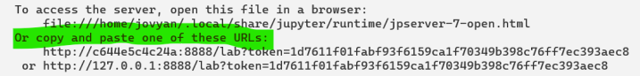
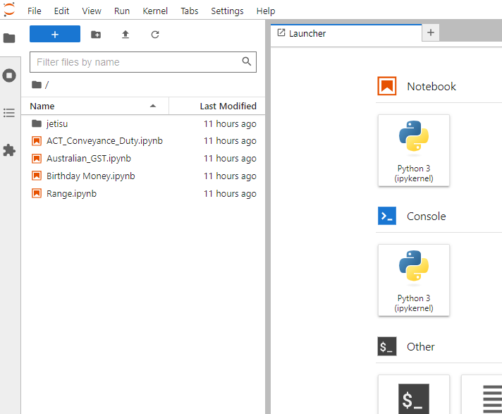
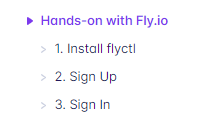
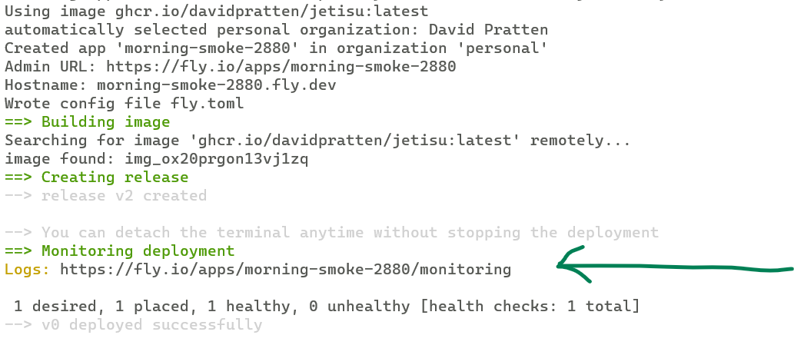

# How to run the example notebooks
Here is a step by step guide to running and/or edit and re-running the example [Jupyter](https://jupyter.org/) notebooks.  This will work where ever docker containers are supported. Here are detailed instructions for two options.  On your own computer and on https://fly.io

## On Docker on your computer
- Install Docker on your computer. https://docs.docker.com/get-docker/
- Open a terminal window and run the following command:
```shell
docker run -p 8888:8888 ghcr.io/davidpratten/jetisu:latest
```
- To open a Jupyter lab browser window like the one below, follow the launch instructions provided by docker in the terminal window e.g.: 



- Double-click on any notebook to edit and/or re-run the examples.

- See here for [Jupyter Notebook Help](https://jupyter-notebook.readthedocs.io/en/stable/notebook.html)



## On fly.io

__SECURITY NOTE__: _after deploying the notebooks to the internet be sure to keep the access token secret. See [Security in Jupyter Notebooks](https://jupyter-server.readthedocs.io/en/latest/operators/security.html#security-in-notebook-documents) for more information._ 

Follow steps 1 to 3 here https://fly.io/docs/hands-on/ 



When you get to step 4. substitute the following steps to launch the Jetisu Toolkit notebooks.

4a. Create a directory on your computer and make it your current directory in your terminal.

4b. Issue the following command to launch the Jetisu Toolkit from the GitHub container repository 

```
flyctl launch --image ghcr.io/davidpratten/jetisu:latest --now --generate-name --region lax --dockerignore-from-gitignore --internal-port 8888
```
fly.io will allocate a unique name for your app and you will see a ```Logs:``` monitoring URL on screen.


4c. Copy and paste your monitoring URL into your browser.  If the launch and deploy were successful, at the bottom of the log you will see the access token allocated to your instance of the Jetisu Toolkit Notebooks.


4d. Copy the access token

4e. Click the Overview link on the top right of the page.


4f. Click the hostname link to go to the notebooks on the web


4g. Paste in the access token that you copied at step 4d. above.


4h. Congratulations! The notebooks are running on the internet and you can edit and run them.


After successful deployment you can set the access token to a string of your own choosing by issuing the following command, providing a [UUID](https://www.uuidgenerator.net/) of your own. After this command is issued, your notebook's server will reboot and start using your token.

```
flyctl secrets set JUPYTER_TOKEN=
```
### Remove the app from fly.io
To remove the app once you are finished with it, use the ```Settings``` link on the dashboard for your app.